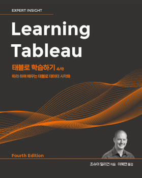

# Learning Tableau

본 책을 통해 태블로를 학습.

 

## 책 소개

 태블로는 VizQL(Visual Query Laguage, 시각화 쿼리 언어)를 사용하는데, 스탠포드대학교의 연구 프로젝트의 결과물로 사람이 시각적으로 자연스럽게 인식하는 방식을 데이터 시각화에 적용할 수 있는 방법에 초점을 맞춘 언어입니다. 이를 통해 태블로에서 데이터 필드를 리포트 영역에 가져다 두고 모양, 크기, 색상을 정의하는 선반에 필드를 끌어다 두면 태블로가 자체적으로 VizQL을 생성해 사용하기 때문에 사용자는 코드 작성이 아닌 데이터 시각화에 집중할 수 있습니다.

'''

 태블로 기능에 대한 방대한 소개와 태블로가 데이터를 처리하는 패러다임에 관한 통찰력, 실무에서 적용하기 좋은 많은 사례를 담은 이 책이 태블로를 처음 접해보거나 좀 더 잘 활용하고자 하는 독자들의 태블로 학습 여정에 지침서가 되길 바랍니다.
    

## 이 책에서 다루는 내용

1장, **태블로 여정의 시작**에서는 태블로의 기본 원칙을 소개한다. 인터페이스에서 데이터 연결, 첫 번째 시각화, 대시보드 구축에 이르기까지 모든 것을 소개하는 논리적인 진행 과정을 통해 여러 예제를 살펴본다. 책 전반에 걸쳐 사용할 용어와 개념의 기초를 제공한다.

2장, **태블로에서 데이터에 연결**에서는 몇 가지 실제 예를 사용해 데이터 연결과 관련된 기본 개념을 다룬다. 다양한 유형의 연결, 파일 유형, 클라우드 기반 및 온 프레미스 데이터베이스, 메타데이터 작업 방법을 다룬다.

3장, **기본 시각화를 넘어서**에서는 1장에서 다룬 기초적인 시각화 원칙을 기반으로 여러 가지 변형과 가능성을 확장해 살펴본다. 다양한 시각화를 사용해 데이터를 분석하고 전달하는 시기와 방법을 알아본다.

4장, **계산과 매개변수**에서는 계산과 매개변수를 소개하고, 주요 계산 유형에 대한 개요를 제공한 후 행 수준과 집계 계산의 자세한 예를 제공한다. 개졈적 지식과 실제 사례를 함께 살펴보고,성ㅇ능 고려 사항으로 마무리 한다.

'''

## REFERENCE

**태블로 데스크톱** : https://www.tableau.com/ko-kr/products/desktop/download

**태블로 프렙 빌더** : https://www.tableau.com/ko-kr/products/prep/download

**예제 코드 다운로드** : https://www.packtpub.com/support

**깃 허브** : https://github.com/PacktPublishing/Learning-Tableau-2020

**컬러 이미지 다운로드** : https://static.packt-cdn.com/downloads/9781789535365_ColorImages.pdf
